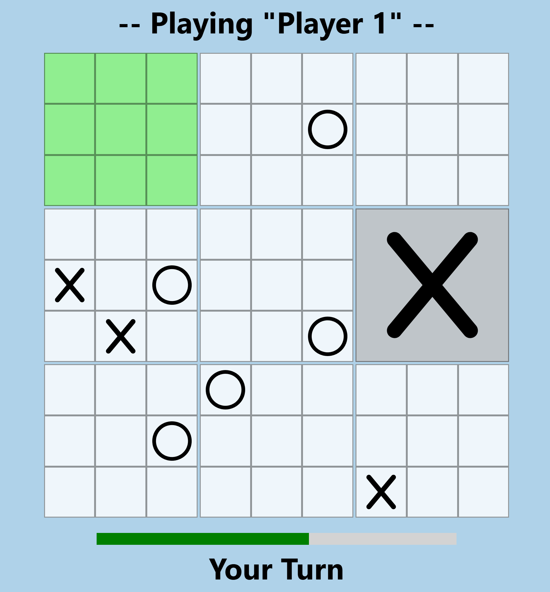

# Ultimate Tic-Tac-Toe

Ein Multiplayer [Ultimate Tic Tac Toe](https://en.wikipedia.org/wiki/Ultimate_tic-tac-toe) Spiel,
entwickelt in Vue.js und einem Node.js-Backend. Das Spiel nutzt Server-Sent Events (SSE) für
Echtzeitkommunikation und ist als Docker-Container verpackt und auf [Render deployed](https://ultimate-tic-tac-toe-sgft.onrender.com/).
(Erster Aufruf kann 30 Sekunden dauern, da die Serverinstanz nur bei Bedarf hochfährt)


### Anforderungen

- Spieler registrieren sich mit einem Nutzernamen (keine Passwörter oder Sicherheitsüberprüfungen erforderlich).
- Spieler können einer Matchmaking-Warteschlange beitreten.
- Zwei Spieler werden automatisch miteinander verbunden, und eine Runde [Ultimate Tic-Tac-Toe](https://en.wikipedia.org/wiki/Ultimate_tic-tac-toe) startet.
- Ein Spieler beginnt mit dem ersten Zug; jeder Zug hat ein Zeitlimit von maximal 20 Sekunden.
- Nach dem Spiel (Sieg, Niederlage oder wenn ein Spieler die Verbindung verliert) kehren beide Spieler zur Startseite zurück.

### Technische Anforderungen

- **Frontend:** Entwickelt mit Vue.js
- **Backend:** Entwickelt mit Node.js und Fastify

### Docker

```sh
docker build -t uttt .
docker run -p 80:8080 -e HOST=0.0.0.0 -e PORT=8080 uttt
```

### Lokale Entwicklung

```sh
npm i
npm start
```
